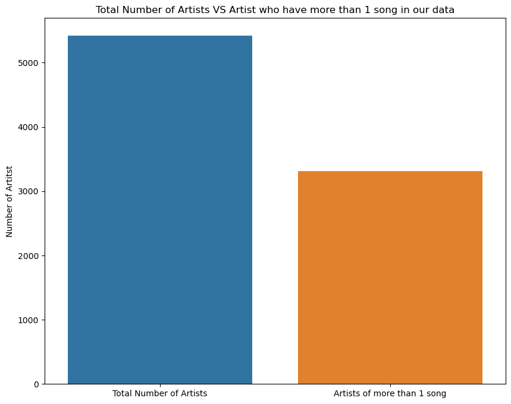
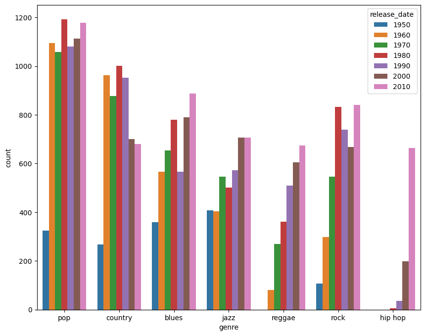
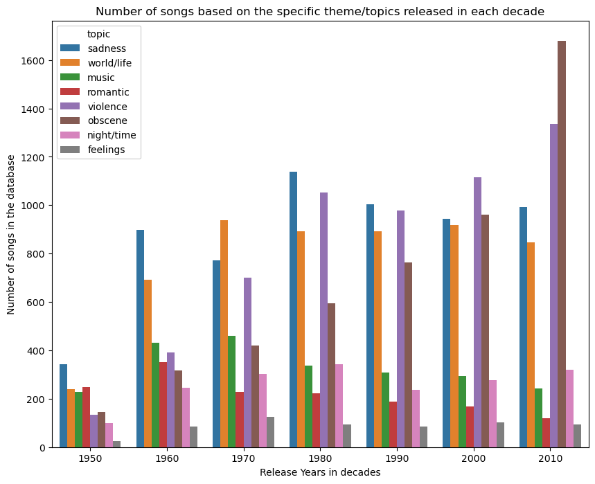

# Music Recommendation Algorithm

  Artwork created by Dalle 3 AI

## Project Overview
This project focuses on the development of an audio recommendation algorithm using unsupervised learning model called K-means. The dataset comprises songs spanning from 1950 to 2019, featuring various lyrical features and metadata. The goal is to create a machine learning pipeline that clusters songs based on their lyrical content and other features, allowing for personalized song recommendations.

The project is structured into the following phases:

### 1. Exploratory Data Analysis (EDA):

- Analyzed data to gain insights into music genres, themes, and artist distribution.
- Explored correlations between different features.
- Identified trends in song release dates, genres, and themes over time.
- Visualized distributions of song lengths, genres, and themes.

#### Insights from EDA:
- Found that out of 5424 artists, only 3308 have more than one song in the training dataset.

- Discovered that the top 10 artists in the dataset are not primarily hip-hop, reggae, or pop artists.

- Bar plot of song counts by genre, shows that the POP genre is the most popular one among every decade represented in our dataset

  

- Bar plot of song counts by theme, shows that the violence and obsenity is the dominant theme of the songs since 2010s 

  

### 2. Data Cleaning:

- Prepared the TEST and TRAIN data for K-Mean Classification Model.
- Dropped irrelevant and strongly correlated columns indentified by use of HEATMAPs.
- Manipulate the dataframes to extract identifiers and features to meet the requirements for classification model.

### 3. Data Modeling:

- Utilized K-means clustering algorithm with 5 clusters, identified by combination of Elbow and Silhouette  Plot.
- Use the developed model on the test dataset.
- Applied Principal Component Analysis (PCA) to reduce dimensionality for visualization.
- Assigned cluster labels to each song and identifier.
- Developed an interactive recommendation tool based on cluster classification.

### 4. Reporting:

- Summarized insights gained from EDA.
- Described the process of determining optimal clusters.
- Provided human-interpretable descriptions of the clusters.
- Presented a recommendation tool for users based on their song preferences.

### Recomentation Tool: 

At the end of the phase 3 and on the phase 4, I introduce the simple python script that use findings of our K-means model to recomend songs to users who will select a prefered song from the list of our songs in our TRAIN dataset. This tool use a simple python commands like if and elif. 

## Future Steps:

- **Enhance Model Performance**: Experiment with different clustering algorithms and hyperparameters to improve the accuracy and robustness of the recommendation algorithm.

- **Lyrical Analysis**: Optionally, conduct a sentiment analysis on the song lyrics using techniques like Word2Vec to extract deeper insights into the emotional content of the songs.

- **Improving Recommendation Tool**:  Enhance the recommendation tool by exploring alternative ways to provide the end user with the song recomentdations based on their favorite song (using the clusters created by our K-Means model)

- **Deployment on AWS and Telegram**: Explore hosting the recommendation system on Amazon Web Services (AWS) for scalability and reliability. Additionally develop a Telegram bot interface for users to interact with the recommendation system seamlessly.
